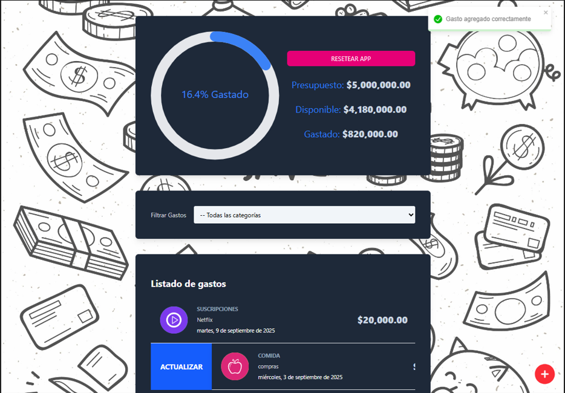

# 💰 Controlador de Gastos

Controlador de Gastos es una aplicación web que permite a los usuarios **ingresar su presupuesto, agregar gastos y clasificarlos por categorías**.  
Además, se pueden **buscar los gastos por categoría** y visualizar un resumen del presupuesto restante de manera interactiva.  

🔗 **Demo en vivo**: [https://budget-controller-rust.vercel.app/](https://budget-controller-rust.vercel.app/)  
🌐 **Portafolio**: [https://portfolio-drab-six-76.vercel.app/](https://portfolio-drab-six-76.vercel.app/)

---

## ✨ Características principales

- 💵 Ingreso de presupuesto inicial y seguimiento del gasto total.  
- 📝 Registro de gastos con detalle y clasificación por categorías.  
- 🔍 Búsqueda y filtrado de gastos por categoría.  
- 📊 Visualización gráfica de presupuesto y gastos con **react-circular-progressbar**.  
- 🗓️ Selección de fechas con **react-calendar** y **react-datepicker**.  
- ⚡ Notificaciones y alertas con **react-toastify** y **SweetAlert2**.  
- ⚡ Interfaz moderna y responsiva con **TailwindCSS**.  

---

## 🛠️ Tecnologías utilizadas

- **React 19** + **TypeScript**  
- **Vite**  
- **TailwindCSS**  
- **React Calendar** y **React DatePicker**  
- **React Circular Progressbar**  
- **React Swipeable List**  
- **React Toastify**  
- **SweetAlert2**  
- **UUID**

---

## 📸 Vista previa

